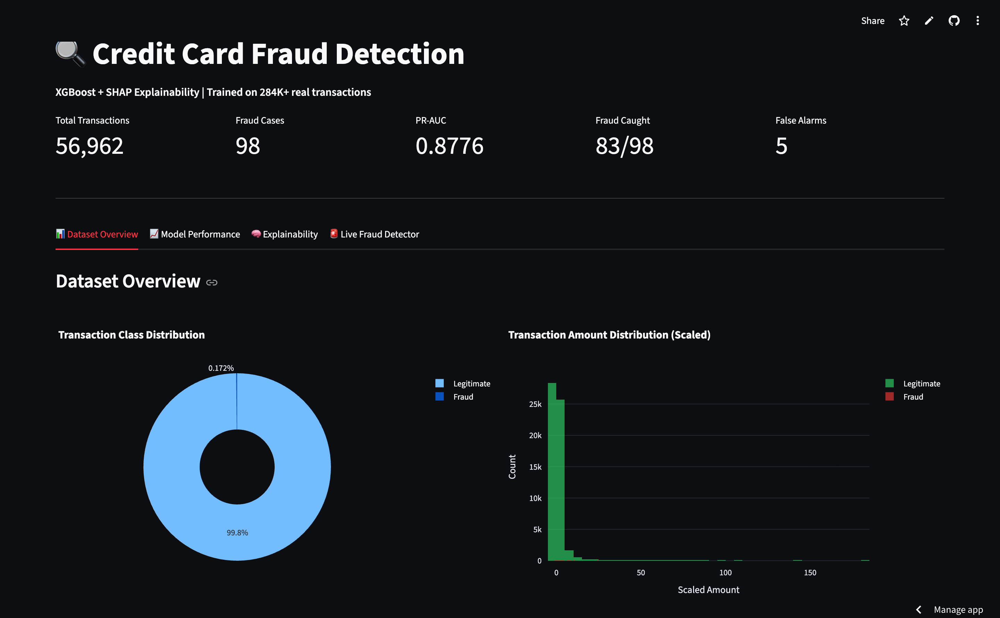
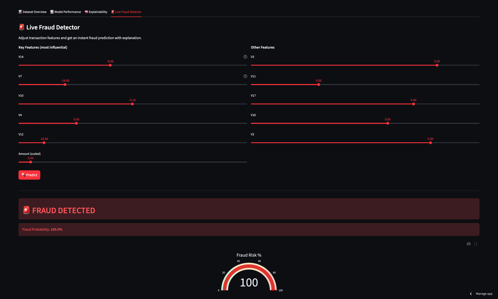
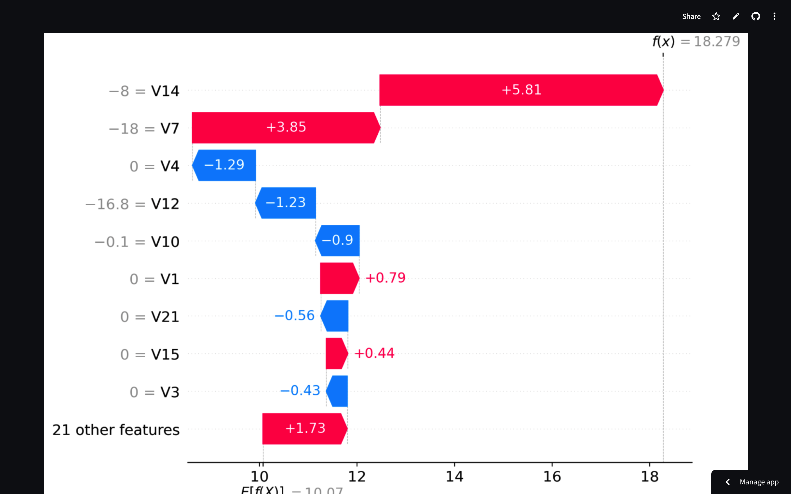

# Credit Card Fraud Detection & Explainability

An end-to-end ML pipeline for detecting credit card fraud with
XGBoost, SHAP explainability, Optuna hyperparameter tuning,
and an interactive Streamlit dashboard.

🚀 **[Live Demo](https://credit-fraud-detection-palak.streamlit.app/)**

---

## Problem Statement

Credit card fraud costs the global economy $32B+ annually.
Traditional rule-based systems generate excessive false alarms,
frustrating customers and overwhelming fraud teams. This project
builds a production-grade ML pipeline that:
- Detects fraud with 85% recall and 94% precision
- Explains every prediction using SHAP values
- Catches 83/98 fraud cases with only 5 false alarms across 56,000+ transactions

---

## Results

| Metric | Value |
|---|---|
| PR-AUC | 0.8776 |
| Recall (fraud caught) | 85% (83/98) |
| Precision | 94% |
| F1 Score | 0.89 |
| False Alarms | 5 / 56,864 legit transactions |
| Optimal Threshold | 0.998 |

> Baseline Logistic Regression PR-AUC: 0.72 →
> Tuned XGBoost PR-AUC: 0.8776 (+21.9% improvement)

---

## Key Findings

### Class Imbalance
Only 0.173% of transactions are fraud (492/284,807).
A naive model predicting "all legitimate" achieves 99.8% accuracy
but catches zero fraud — demonstrating why PR-AUC and Recall
are the correct metrics here, not accuracy.

### Most Influential Fraud Features (SHAP Analysis)
| Feature | In Top-3 SHAP For | Direction |
|---|---|---|
| V14 | 90/98 fraud cases (92%) | Negative values → Fraud |
| V7  | 65/98 fraud cases (66%) | Negative values → Fraud |
| V10 | 58/98 fraud cases (59%) | Negative values → Fraud |

### Threshold Tuning
Default threshold (0.5) gave F1 of 0.71.
Optimising threshold to 0.998 improved F1 to 0.89 —
a 25% improvement with no model retraining required.

### Interesting Finding
V7 ranked 2nd in SHAP importance but had only moderate linear
correlation in EDA. The model captures non-linear interactions
that simple correlation analysis misses.

### Transaction Amount Pattern
Median fraud amount ($9.25) is significantly lower than median
legitimate amount ($22.00) — fraudsters test stolen cards
with small transactions before attempting larger ones.

---

## Architecture

```
Raw Data (284,807 transactions, 0.17% fraud)
        │
        ▼
┌──────────────────────┐
│     Preprocessing    │
│  RobustScaler        │
│  Stratified Split    │
│  SMOTETomek          │
│  (handles imbalance) │
└──────────┬───────────┘
           ▼
┌──────────────────────┐
│    Model Training    │
│  Baseline: LR/RF/XGB │
│  Optuna (30 trials)  │
│  MLflow tracking     │
└──────────┬───────────┘
           ▼
┌──────────────────────┐
│  Threshold Tuning    │
│  0.5 → 0.998         │
│  F1: 0.71 → 0.89     │
└──────────┬───────────┘
           ▼
┌──────────────────────┐
│   SHAP Analysis      │
│  Global importance   │
│  Per-prediction      │
│  Waterfall plots     │
└──────────┬───────────┘
           ▼
┌──────────────────────┐
│  Streamlit Dashboard │
│  4-tab interface     │
│  Live fraud detector │
│  Deployed on Cloud   │
└──────────────────────┘
```

---

## Tech Stack

| Technology | Purpose |
|---|---|
| XGBoost | Primary classifier |
| Optuna | Hyperparameter tuning (30 trials) |
| MLflow | Experiment tracking |
| SHAP | Model explainability |
| imbalanced-learn | SMOTETomek resampling |
| Scikit-Learn | Preprocessing, baselines, metrics |
| Streamlit | Dashboard & deployment |
| Plotly | Interactive visualizations |

---

## Dashboard Features

- **Dataset Overview** — class distribution, amount analysis,
  feature correlations
- **Model Performance** — confusion matrix, PR curve,
  interactive threshold slider with real-time metric updates
- **Explainability** — SHAP summary plot, waterfall plot,
  top fraud signal table
- **Live Fraud Detector** — adjust transaction features,
  get instant fraud probability with gauge and SHAP explanation

---

## Screenshots

### Dashboard Overview


### Live Fraud Detector


### SHAP Waterfall — Most Confident Fraud Case


---

## Local Setup

```bash
git clone https://github.com/Palakkumari19/credit-fraud-detection
cd credit-fraud-detection
python -m venv venv
source venv/bin/activate  # Windows: venv\Scripts\activate
pip install -r requirements.txt
```

Download the raw dataset from Kaggle and place at
`data/raw/creditcard.csv`, then run notebooks in order:

```bash
jupyter notebook notebooks/01_eda.ipynb
jupyter notebook notebooks/02_preprocessing.ipynb
jupyter notebook notebooks/03_modelling.ipynb
jupyter notebook notebooks/04_shap.ipynb
```

Then launch the app:
```bash
streamlit run app.py
```

---

## Project Structure

```
credit-fraud-detection/
├── data/
│   ├── processed/
│   │   └── test_data.csv      ← preprocessed test split
│   └── README.md              ← dataset download instructions
├── models/
│   ├── xgb_final.pkl          ← trained model
│   ├── model_config.pkl       ← threshold + feature names
│   ├── shap_summary.png
│   └── shap_waterfall.png
├── notebooks/
│   ├── 01_eda.ipynb
│   ├── 02_preprocessing.ipynb
│   ├── 03_modelling.ipynb
│   └── 04_shap.ipynb
├── app.py
├── requirements.txt
└── README.md
```

---

## Author

Palak Kumari
[GitHub](https://github.com/Palakkumari19) |
[LinkedIn](https://www.linkedin.com/in/palak-kumari-828779200/)